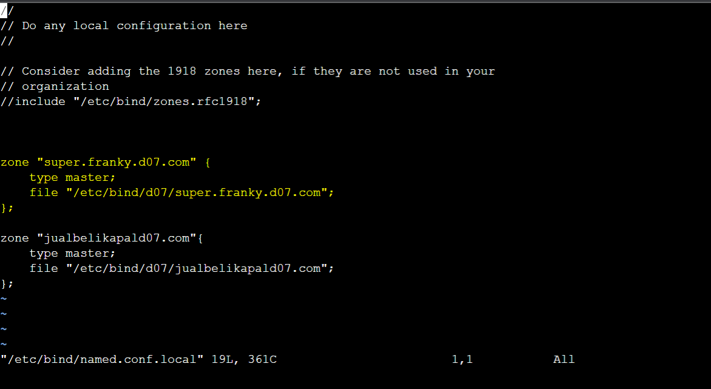
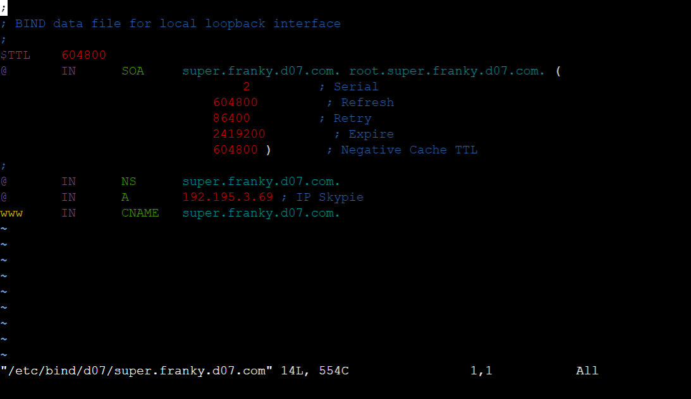
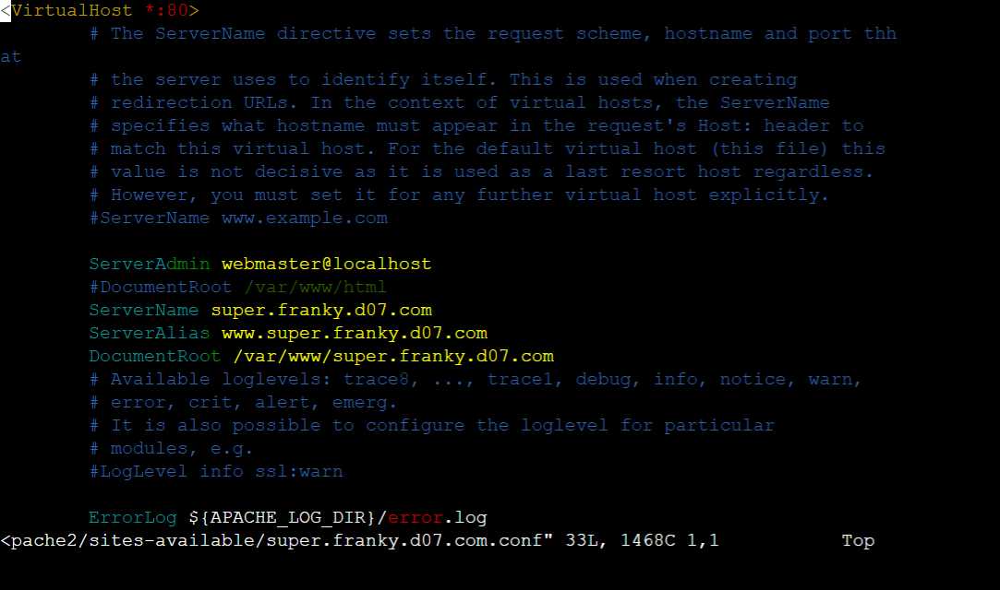
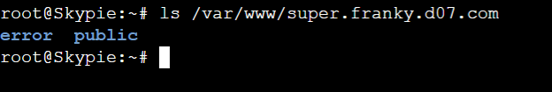
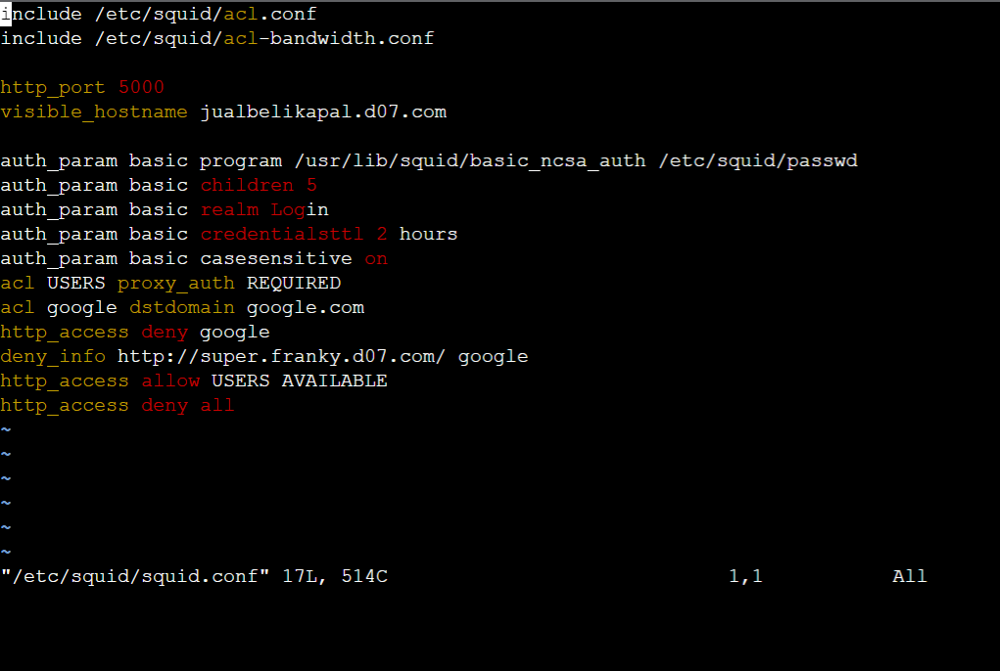

# Jarkom-Modul-3-D07-2021
### Anggota kelompok:
Anggota | NRP | 
------------- | ------------- | 
Amanda Rozi Kurnia | 05111940000094 | 
Dyandra Paramitha W. | 05111940000119 |
Daanii Nabil Ghinannafsi Kusnanta | 05111940000163 |

## Notes
[Soal Shift 3](https://docs.google.com/document/d/1hwuI5YpxiP-aboS7wGWPbaQeSOQl0HHVHLT3ws2BPUk/edit?usp=sharing) <br>
**Prefix:** 192.195


## Daftar Isi
* [Pendahuluan](#pendahuluan)
    * [Setting Topologi](#setting)
    * [Edit Konfigurasi Network](#edit)
* [Soal 1](#soal1)
* [Soal 2](#soal2)
* [Soal 3](#soal3)
* [Soal 4](#soal4)
* [Soal 5](#soal5)
* [Soal 6](#soal6)
* [Soal 7](#soal7)
* [Soal 8](#soal8)
* [Soal 9](#soal9)
* [Soal 10](#soal10)
* [Soal 11](#soal11)
* [Soal 12](#soal12)
* [Soal 13](#soal13)
* [Kendala Yang Dialami](#kendala)
* [Referensi](#referensi)


## <a name="pendahuluan"></a> Pendahuluan

### <a name="setting"></a> Setting Topologi

<image src="screenshots/1.PNG" width="700">

### <a name="edit"></a> Edit Knofigurasi Network

#### Pada Server
<image src="screenshots/0-1.PNG" width="700">
<image src="screenshots/0-2.PNG" width="700">
<image src="screenshots/0-3.PNG" width="700">
<image src="screenshots/0-4.PNG" width="700">


#### Pada Client (Loguetown, Alabasta, Tottoland, Skypie)

<image src="screenshots/0-5.PNG" width="700">

## <a name="soal1"></a> Soal 1

Luffy bersama Zoro berencana membuat peta tersebut dengan kriteria EniesLobby sebagai DNS Server, Jipangu sebagai DHCP Server, Water7 sebagai Proxy Server

### Jawab

#### Pendahuluan Konfigurasi

Menjalankan command `iptables -t nat -A POSTROUTING -o eth0 -j MASQUERADE -s 192.195.0.0/16` yang digunakan supaya dapat terhubung ke jaringan luar pada router `Foosha`

Setelah itu pada EniesLobby, Water7, Jipangu dijalankan command `echo "nameserver 192.168.122.1" > /etc/resolv.conf` untuk setting IP DNS agar dapat terhubung ke jaringan luar.

#### Instalasi 
Menjalani instalasi berikut pada setiap server:
```bash
# Pada Ennieslobby
apt-get update
apt-get install bind9 -y

#pada Jipangu
apt-get update
apt-get install isc-dhcp-server -y

#pada water7
apt-get update
apt-get install squid -y
```

#### Jipangu
Melakukan setting pada file `/etc/default/isc-dhcp-server` dengan menambahkan `eth0` pada `INTERFACES`
<image src="screenshots/1-1.PNG" width="700">

## <a name="soal2"></a> Soal 2

Foosha sebagai DHCP Relay

### Jawab

#### Foosha

Menjalankan command `apt-get update` dan `apt-get install isc-dhcp-relay -y` untuk menginstall isc-dhcp-relay
```bash
apt-get update
DEBIAN_FRONTEND=noninteractive apt-get install -y -q isc-dhcp-relay
```
`DEBIAN_FRONTEND=noninteractive` digunakan agar saat menginstall tidak meminta input dan bisa terinstall terlebih dahulu. 

Kemudian edit file `/etc/default/isc-dhcp-relay` dengan menambahkan Ip Jipangu pada input Server dan `eth1 eth2 eth3` pada input Interfaces di dalamnya. 

<image src="screenshots/2-1.PNG" width="700">

Lalu jalankan command `service isc-dhcp-relay start`

## <a name="soal3"></a> Soal 3

Client yang melalui Switch1 mendapatkan range IP dari [prefix IP].1.20 - [prefix IP].1.99 dan [prefix IP].1.150 - [prefix IP].1.169

### Jawab

#### Jipangu

Mengedit file `/etc/dhcp/dhcpd.conf`:

```bash
subnet 192.195.1.0 netmask 255.255.255.0 {
    range 192.195.1.20 192.195.1.99;
    range 192.195.1.150 192.195.1.169;
    option routers 192.195.1.1;
    option broadcast-address 192.195.1.255;
    option domain-name-servers 192.195.2.2;
    default-lease-time 360;
    max-lease-time 7200;
}
```

<image src="screenshots/3-1.PNG" width="700">

Lalu jalankan command `service isc-dhcp-server restart`


#### Testing
Nyalakan `Alabasta` atau `Loguetown` dan masukkan command `ip a`

<image src="screenshots/3-2.PNG" width="700">
<image src="screenshots/3-3.PNG" width="700">


## <a name="soal4"></a> Soal 4

Client yang melalui Switch3 mendapatkan range IP dari [prefix IP].3.30 - [prefix IP].3.50

### Jawab

#### Jipangu

Edit file `/etc/dhcp/dhcpd.conf` dengan menambahkan:

```bash
subnet 192.195.3.0 netmask 255.255.255.0 {
    range 192.195.3.30 192.195.3.50;
    option routers 192.195.3.1;
    option broadcast-address 192.195.3.255;
    option domain-name-servers 192.195.2.2;
    default-lease-time 720;
    max-lease-time 7200;
}
```

<image src="screenshots/4-1.PNG" width="700">

Lalu jalankan command `service isc-dhcp-server restart`

#### Testing
Nyalakan `Skypie` atau `Tottoland` dan masukkan command `ip a`

<image src="screenshots/4-2.PNG" width="700">

## <a name="soal5"></a> Soal 5

Client mendapatkan DNS dari EniesLobby dan client dapat terhubung dengan internet melalui DNS tersebut.

### Jawab

#### EniesLobby

Mengedit file `/etc/bind/named.conf.options` dengan mengubah:

```bash
forwarders {
    192.168.122.1;
};

allow-query{any;};
```

dan melakukan comment bagian

```bash
// dnssec-validation auto;
```
<image src="screenshots/5-1.PNG" width="700">


kemudian jalankan command `service bind9 restart`

#### Jipangu

Mengedit file `/etc/dhcp/dhcpd.conf` dengan menambahkan IP Ennieslobby pada `option domain-name-servers` pada `subnet 192.195.1.0` dan `subnet 192.195.3.0`

<image src="screenshots/3-1.PNG" width="700">
<image src="screenshots/4-1.PNG" width="700">

#### Testing
Mencoba melakukan `ping google.com`. Apabila bisa, artinya sudah tersambung. 
<image src="screenshots/5-2.PNG" width="700">

## <a name="soal6"></a> Soal 6

Lama waktu DHCP server meminjamkan alamat IP kepada Client yang melalui Switch1 selama 6 menit sedangkan pada client yang melalui Switch3 selama 12 menit. Dengan waktu maksimal yang dialokasikan untuk peminjaman alamat IP selama 120 menit.

### Jawab

#### Jipangu

Mengedit file `/etc/dhcp/dhcpd.conf` dengan menambahkan baris ini pada `subnet 192.195.1.0`

```bash
    default-lease-time 360;
    max-lease-time 7200;
```
Dikarenakan 6 menit = 360 detik (untuk default-lease-time), dan 120 menit = 7200 detik (untuk max-lease-time)


<image src="screenshots/3-1.PNG" width="700">

dan mengedit baris ini pada `subnet 192.195.3.0`

```bash
    default-lease-time 720;
    max-lease-time 7200;
```
Dikarenakan 12 menit = 720 detik (untuk default-lease-time), dan 120 menit = 7200 detik (untuk max-lease-time)

<image src="screenshots/4-1.PNG" width="700">

#### Testing
Terlihat tulisan `lease-time` sesuai dengan konfigurasi pada client. 

<image src="screenshots/6-1.PNG" width="700">
<image src="screenshots/6-2.PNG" width="700">
<image src="screenshots/6-3.PNG" width="700">
<image src="screenshots/6-4.PNG" width="700">


## <a name="soal7"></a> Soal 7

Luffy dan Zoro berencana menjadikan Skypie sebagai server untuk jual beli kapal yang dimilikinya dengan alamat IP yang tetap dengan IP [prefix IP].3.69

### Jawab

#### Jipangu

Edit file `/etc/dhcp/dhcpd.conf` dengan menambahkan baris ini

```bash
host Skypie {
hardware ethernet 16:9d:2a:0f:ca:55;
fixed-address 192.195.3.69;
}
```

<image src="screenshots/7-1.PNG" width="700">

Lalu jalankan command `service isc-dhcp-server restart`

#### Skypie

Kemudian tambahkan `hwaddress ether hwaddress ether 16:9d:2a:0f:ca:55"` pada `/etc/network/interfaces` agar hwaddress tidak berubah/statis. 

<image src="screenshots/7-2.PNG" width="700">

#### Testing
Lakukan restart pada client, kemudian command `ip a`
<image src="screenshots/7-3.PNG" width="700">

## <a name="soal8"></a> Soal 8

Loguetown digunakan sebagai client Proxy agar transaksi jual beli dapat terjamin keamanannya, juga untuk mencegah kebocoran data transaksi.
Pada Loguetown, proxy harus bisa diakses dengan nama jualbelikapal.yyy.com dengan port yang digunakan adalah 5000

### Jawab

#### Water7

Mengedit file `/etc/squid/squid.conf` dengan menambahkan

```bash
    http_port 5000
    visible_hostname jualbelikapald07.com
    http_access allow all
```

<image src="screenshots/8-1.PNG" width="700">

kemudian jalankan command `service squid restart`

#### Ennieslobby
Membuat domain jualbelikapald07.com pada Ennieslobby seperti pada modul 2. 
Mengedit file `/etc/bind/named.conf.local`

```bash
zone "jualbelikapald07.com"{
    type master;
    file "/etc/bind/d07/jualbelikapald07.com";
};
```
<image src="screenshots/8-2.PNG" width="700">

Membuat folder baru pada bind dengan `mkdir /etc/bind/d07` dan kemudian melakukan copy `cp /etc/bind/db.local /etc/bind/d07/jualbelikapald07.com`

Mengedit file `/etc/bind/d07/jualbelikapald07.com` dengan:
```bash
$TTL    604800
@       IN      SOA     jualbelikapald07.com. root.jualbelikapald07.com. (
                                2         ; Serial
                            604800         ; Refresh
                            86400         ; Retry
                            2419200         ; Expire
                            604800 )       ; Negative Cache TTL
;
@       IN      NS      jualbelikapald07.com.
@       IN      A       192.195.2.3 ; IP Skypie
www     IN      CNAME   jualbelikapald07.com.

```

Melakukan `service bind9 restart`. 


#### Loguetown

Jalankan `apt-get update` dan `apt-get install lynx`

Aktifkan proxy dengan menjalankan command `export http_proxy="http://jualbelikapald07.com:5000"`. Untuk melihat apakah sudah tersetting, jalankan command `env | grep -i proxy`

<image src="screenshots/8-3.PNG" width="700">


#### Testing
Lakukan `lynx "website terserah` pada Loguetown. 

<image src="screenshots/8-4.PNG" width="700">

Note: Halaman terkena access denied dikarenakan saat testing belum diganti waktunya dan masih terkena konfigurasi pembatasan waktu. Terlihat bahwa proxy sudah jalan dikarenakan host_name pada halaman sama dengan konfigurasi. 

## <a name="soal9"></a> Soal 9
Agar transaksi jual beli lebih aman dan pengguna website ada dua orang, proxy dipasang autentikasi user proxy dengan enkripsi MD5 dengan dua username, yaitu luffybelikapalyyy dengan password luffy_yyy dan zorobelikapalyyy dengan password zoro_yyy
    
### Jawab

#### Pada Water7
Restart squid pada node Water7 kemudian jalankan command berikut:
```
   htpasswd -c /etc/squid/passwd luffybelikapald07
```
Command `-c` digunakan untuk membuat file baru dan untuk MD5 sendiri sudah merupakan default. Setelah itu, input password `luffy_d07`. Selanjutnya, jalankan command berikut:
```
   htpasswd /etc/squid/passwd zorobelikapald07
```
Lalu, input password `zoro_d07`. Edit file `/etc/squid/squid.conf` menjadi seperti berikut:
```
   auth_param basic program /usr/lib/squid/basic_ncsa_auth /etc/squid/passwd
   auth_param basic children 5
   auth_param basic realm Proxy
   auth_param basic credentialsttl 2 hours
   auth_param basic casesensitive on
   acl USERS proxy_auth REQUIRED
   http_access allow USERS
   service squid restart
```
   
Jalankan command `service squid restart`.

## <a name="soal10"></a> Soal 10
Transaksi jual beli tidak dilakukan setiap hari, oleh karena itu akses internet dibatasi hanya dapat diakses setiap hari Senin-Kamis pukul 07.00-11.00 dan setiap hari Selasa-Jum’at pukul 17.00-03.00 keesokan harinya (sampai Sabtu pukul 03.00)

### Jawab
   
#### Water7
   
Menjalankan `vi /etc/squid/acl.conf` untuk memodifikasi file tersebut untuk ditambahkan:
```bash
acl AVAILABLE time M T W H 07:00-11:00
acl AVAILABLE time T W H F 17:00-23:59
acl AVAILABLE time W H F A 00:00-03:00
```
   <image src="screenshots/10-1.PNG" width="700">
   
Setelah itu edit file `/etc/squid/squid.conf` :
```bash
    include /etc/squid/acl.conf

    http_port 5000
    visible_hostname jualbelikapal.d07.com

    auth_param basic program /usr/lib/squid/basic_ncsa_auth /etc/squid/passwd
    auth_param basic children 5
    auth_param basic realm Login
    auth_param basic credentialsttl 2 hours
    auth_param basic casesensitive on
    acl USERS proxy_auth REQUIRED
    http_access allow USERS AVAILABLE
    http_access deny all
```
<image src="screenshots/10-2.PNG" width="700">
   
Kemudian jalankan command `service squid restart`.

#### Testing
Apabila waktu saat mengakses sebuah website tidak sesuai dengan jam pada file `acl.conf` maka akan terjadi error dan access akan di-deny. 

<image src="screenshots/8-4.PNG" width="700">

Apabila waktu sesuai dengan jam maka halaman akan terbuka sesuai dengan website yang ingin dituju. Contoh: saat mengakses halaman its.ac.id.
<image src="screenshots/10-3.PNG" width="700">
    
## <a name="soal11"></a> Soal 11
Agar transaksi bisa lebih fokus berjalan, maka dilakukan redirect website agar mudah mengingat website transaksi jual beli kapal. Setiap mengakses google.com, akan diredirect menuju super.franky.yyy.com dengan website yang sama pada soal shift modul 2. Web server super.franky.yyy.com berada pada node Skypie.

### Jawab
#### Pada EniesLobby
Edit file `/etc/bind/named.conf.local` menjadi seperti berikut:
```
   zone "super.franky.d07.com" {
      type master;
      file "/etc/bind/sunnygo/super.franky.d07.com";
   };
   
   zone "3.195.192.in-addr.arpa" {
      type master;
      file "/etc/bind/sunnygo/3.195.192.in-addr.arpa";
   };
```


Kemudian, buat filder sunnygo dengan command `mkdir /etc/bind/sunnygo`. Setelah itu, jalankan command berikut:
```
   cp /etc/bind/db.local /etc/bind/sunnygo/super.franky.D07.com
```

Lalu, edit file `/etc/bind/sunnygo/super.franky.D07.com` menjadi seperti berikut:
```
   $TTL    604800
   @       IN      SOA     super.franky.d07.com. root.super.franky.d07.com. (
                                   2         ; Serial
                               604800         ; Refresh
                               86400         ; Retry
                               2419200         ; Expire
                               604800 )       ; Negative Cache TTL
   ;
   @       IN      NS      super.franky.d07.com.
   @       IN      A       192.195.3.69 ; IP Skypie
   www     IN      CNAME   super.franky.d07.com.
```



Kemudian, jalankan command berikut:
```
   cp /etc/bind/db.local /etc/bind/sunnygo/3.195.192.in-addr.arpa
```
Dan edit file `/etc/bind/sunnygo/3.195.192.in-addr.arpa`
```
   $TTL    604800
   @       IN      SOA     super.franky.d07.com. root.super.franky.d07.com. (
                                   2         ; Serial
                               604800         ; Refresh
                               86400         ; Retry
                               2419200         ; Expire
                               604800 )       ; Negative Cache TTL
   ;
   3.195.192.in-addr.arpa.      IN      NS      super.franky.d07.com.
   69       IN      PTR       super.franky.d07.com.
 ```
   
   Restart dengan `service bind9 restart`.
   
#### Pada Skypie
Install apache2, php, libapache2-mod-php7, wget dan unzip.
```
   apt-get update
   apt-get install apache2
   apt-get install php
   apt-get install libapache2-mod-php7.0
   apt-get install wget
   apt-get install unzip
```
   
Selanjutnya, jalankan command berikut untuk mendowload file zip.
```
   wget https://raw.githubusercontent.com/FeinardSlim/Praktikum-Modul-2-Jarkom/mai/super.franky.zip
unzip super.franky.zip
```
   
Pindah ke directory `/etc/apache2/sites-available` kemudian copy file `000-default.conf` ke `super.franky.D07.com.conf`.
```
   cd /etc/apache2/sites-available
   cp 000-default.conf super.franky.d07.com.conf
```

Setting file `super.franky.d07.com.conf` dan ganti isinya menjadi:
```
   ServerAdmin webmaster@localhost
   #DocumentRoot /var/www/html
   ServerName super.franky.d07.com
   ServerAlias www.super.franky.d07.com
   DocumentRoot /var/www/super.franky.d07.com
```


   
Buat directory baru dengan nama `super.franky.d07.com` pada `/var/www/` dengan command:
```
   mkdir /var/www/super.franky.d07.com
```
   
Kemudian, jalankan command berikut:
```
   cp -r /root/super.franky/error /var/www/super.franky.d07.com
   cp -r /root/super.franky/public /var/www/super.franky.d07.com
```



#### Pada Water7
Edit file `/etc/squid/squid.conf` menjadi:
```
   include /etc/squid/acl.conf
   include /etc/squid/acl-bandwidth.conf
   
   http_port 5000
   visible_hostname jualbelikapal.d07.com
   
   auth_param basic program /usr/lib/squid/basic_ncsa_auth /etc/squid/passwd
   auth_param basic children 5
   auth_param basic realm Login
   auth_param basic credentialsttl 2 hours
   auth_param basic casesensitive on
   acl USERS proxy_auth REQUIRED
   acl google dstdomain google.com
   http_access deny google
   deny_info http://super.franky.d07.com/ google
   http_access allow USERS AVAILABLE
   http_access deny all
```

Kemudian, edit file `/etc/resolv.conf` menjadi `nameserver 192.195.2.2` dan jalankan command `service squid restart`.
   


Terakhir, jalankan command `a2ensite super.franky.d07.com` dan restart dengan command `service apache2 restart`.
    
## <a name="soal12"></a> Soal 12
Saatnya berlayar! Luffy dan Zoro akhirnya memutuskan untuk berlayar untuk mencari harta karun di super.franky.yyy.com. Tugas pencarian dibagi menjadi dua misi, Luffy bertugas untuk mendapatkan gambar (.png, .jpg), sedangkan Zoro mendapatkan sisanya. Karena Luffy orangnya sangat teliti untuk mencari harta karun, ketika ia berhasil mendapatkan gambar, ia mendapatkan gambar dan melihatnya dengan kecepatan 10 kbps

### Jawab
    
## <a name="soal13"></a> Soal 13
Sedangkan, Zoro yang sangat bersemangat untuk mencari harta karun, sehingga kecepatan kapal Zoro tidak dibatasi ketika sudah mendapatkan harta yang diinginkannya.
    
### Jawab
    
## <a name="kendala"></a> Kendala yang Dialami
   - Terkendala dalam menjawab soal 12-13 akan tetapi teratasi setelah membaca beberapa dokumentasi. 

## <a name="referensi"></a> Referensi
